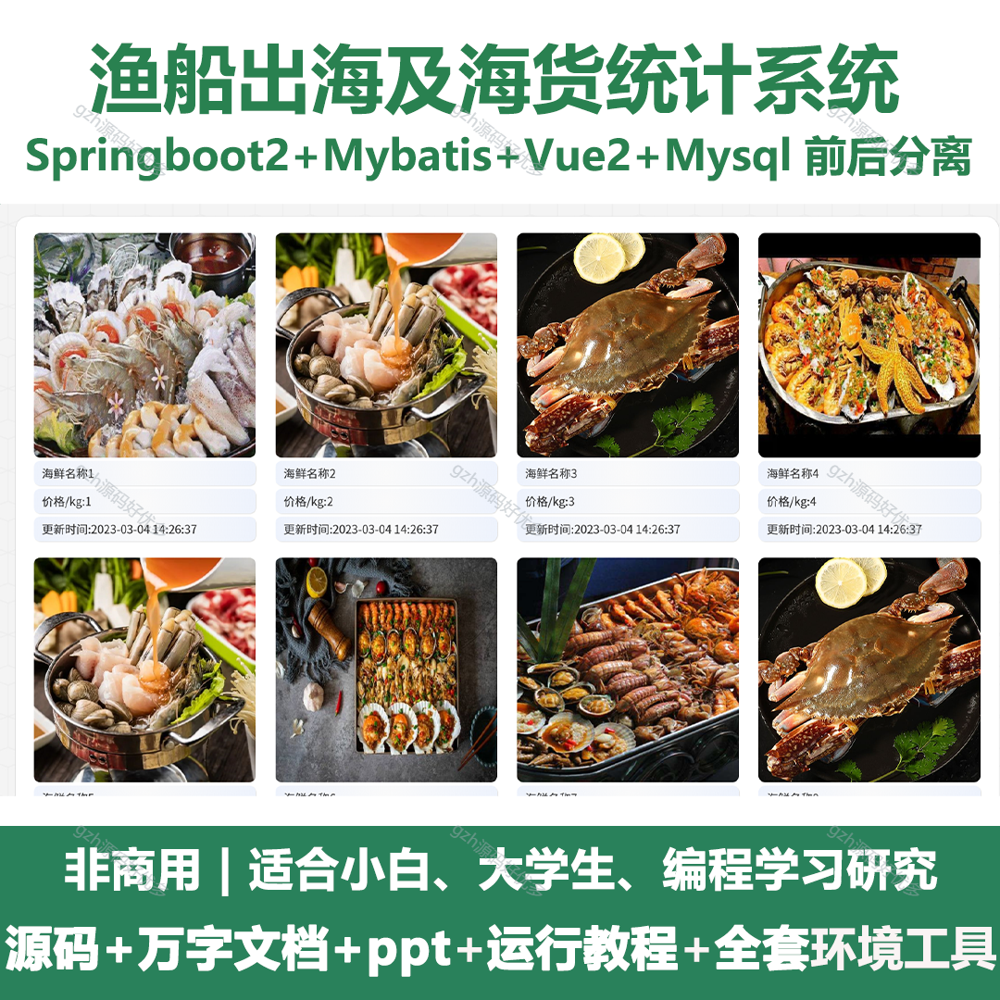
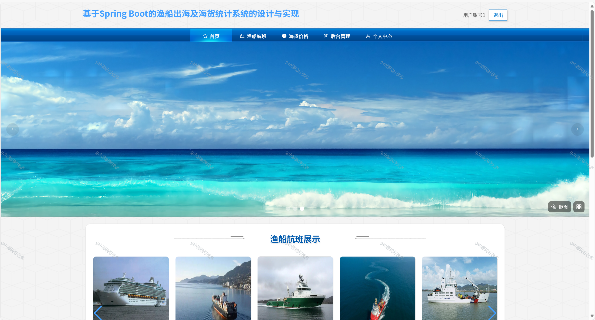
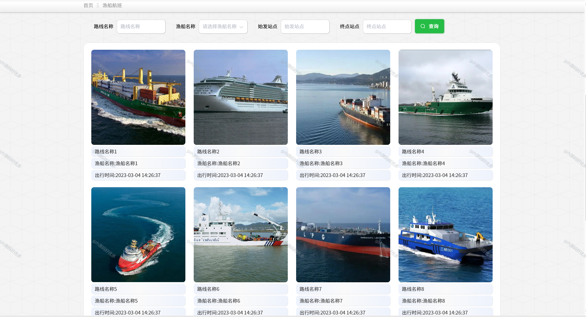
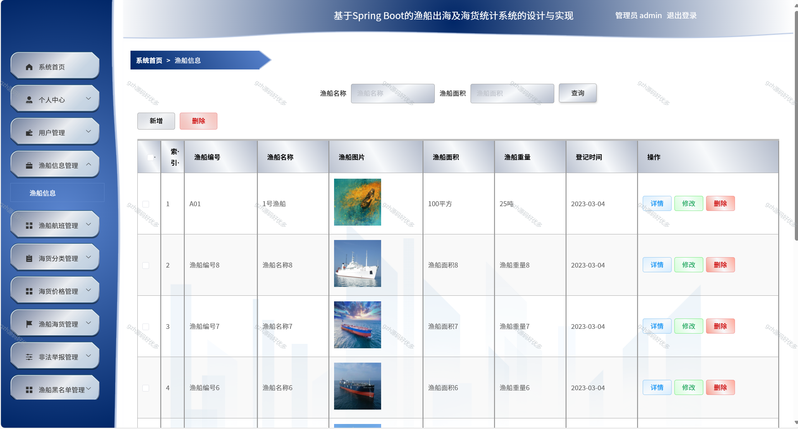
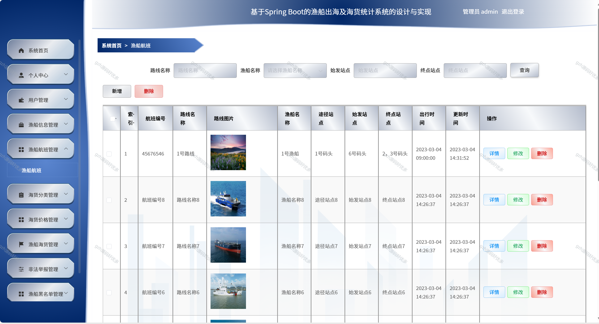
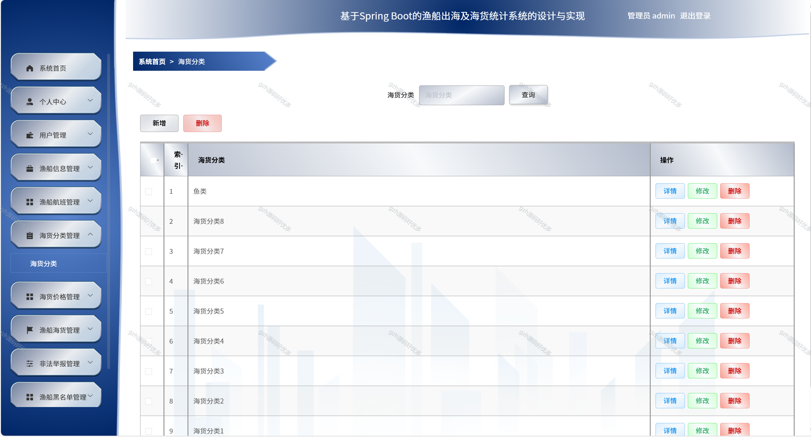
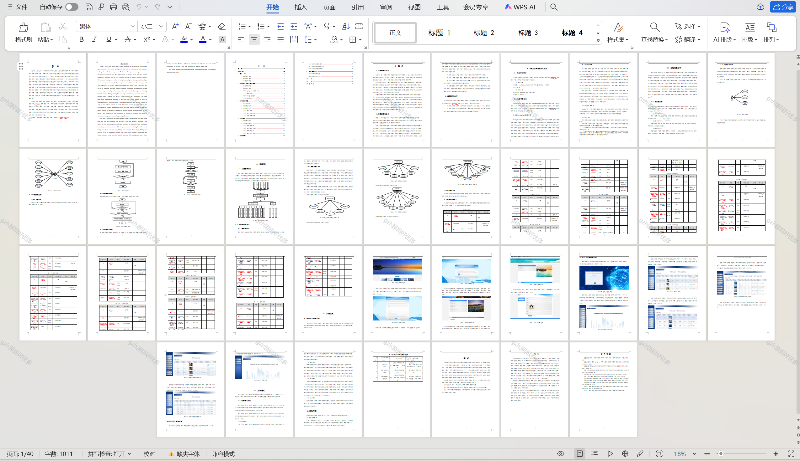

# springbootA336
springbootA336渔船出海及海货统计系统+LW+PPT
 
## 查看主页获取源码 

### 一、关键词

渔船出海作业及海产统计系统，渔船及海货统计系统，渔船出海及海货数据管理系统

### 二、作品包含

源码+数据库+万字设计文档+PPT+全套环境和工具资源+本地部署教程

### 三、项目技术

前端技术：Html、Css、Js、Vue2.0、Element-ui 
后端技术：Java、SpringBoot2.0、MyBatis

  
### 四、运行环境（以下版本亲测，其他版本未知，请自测）

开发工具：IDEA/eclipse  + VSCODE

数据库：MySQL5.7（最低要5.7版本）

数据库管理工具：Navicat10以上版本

环境配置软件： JDK1.8 + Maven3.6.3

前端Nodejs：14

浏览器：谷歌浏览器

### 五、项目介绍

项目编号：springbootA336

研发一套渔船出海及海货统计系统，既能够大大提高信息的检索、变更与维护的工作效率，也能够方便信息系统的管理运用，从而减少信息管理成本，提高效率。
该渔船出海及海货统计系统采用B/S架构、前后端分离进行设计，并采用java语言以及springboot框架进行开发。该系统主要设计并完成了管理过程中的用户注册登录、个人信息修改、用户信息、渔船信息、渔船航班、海货价格、渔船海货、非法举报、渔船黑名单等功能。该系统操作简便，界面设计简洁，不但可以基本满足本行业的日常管理工作，同时又可以有效减少人员成本和时间成本，为渔船出海及海货统计工作提供了方便。

### 六、运行截图

